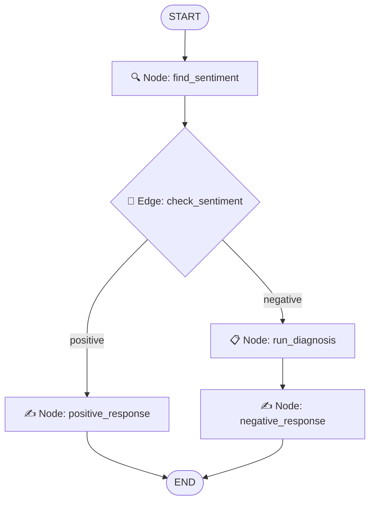

# 🛍️ Aura Threadworks | AI Customer Support Agent POC

A highly polished, interactive e-commerce and AI customer care proof-of-concept (POC) application. This project showcases a custom-built, intelligent customer support agent using **LangGraph**, **LangChain**, and **Streamlit** to automatically respond to product reviews based on sentiment, tone, urgency, and category.

Designed specifically for portfolios, it features a complete catalog of 30 mock premium clothing products, an interactive review playground, and a **real-time visual execution tracer** showing how the LangGraph state machine routes and processes incoming reviews.

---

## 🛠️ Tech Stack

- **Frontend UI**: [Streamlit](https://streamlit.io/) (Styled with premium custom CSS and fonts)
- **Agent Orchestration**: [LangGraph](https://github.com/langchain-ai/langgraph) (StateGraph state machine)
- **LLM Integration**: [LangChain](https://github.com/langchain-ai/langchain) (`ChatOpenAI` wrapper)
- **Data Validation & Parsing**: [Pydantic v2](https://docs.pydantic.dev/) (`with_structured_output` JSON schema enforcement)
- **API Provider**: [Groq API](https://console.groq.com/) (High-speed Llama 3 / Mixtral inference)
- **Environment Management**: [Python-dotenv](https://github.com/theofidry/django-dotenv)

---

## 📐 Agent Architecture (LangGraph Flow)

The customer review responder agent utilizes a conditional StateGraph workflow to route and process input reviews:



### Workflow Nodes:
1. **`find_sentiment`**: Leverages Pydantic structured output validation to determine if a review is `positive` or `negative`.
2. **`check_sentiment` (Router)**: Evaluates the classification state and routes execution to the appropriate node.
3. **`positive_response`**: Synthesizes a warm, friendly customer-appreciation response thanking them for their support.
4. **`run_diagnosis`**: Leverages a separate Pydantic schema to extract:
   - *Issue Category*: UX/UI, Performance, Bug, Support, or Other.
   - *Emotional Tone*: Angry, Frustrated, Disappointed, or Calm.
   - *Urgency Level*: High, Medium, or Low.
5. **`negative_response`**: Feeds the metadata into the LLM system prompt to write an empathetic, customized resolution message addressing the customer's specific issue.

---

## ✨ Features

- **Collection Grid**: Displays 30 realistic premium apparel and accessory products with categories, descriptions, average star ratings, prices, and high-quality visuals.
- **Product Filters**: Search and filter by category (All, Outerwear, Tops, Bottoms, Accessories).
- **Interactive Playground**: Leave reviews or instantly auto-fill one of the preset review templates (e.g. Critical Bug, UI Misalignment, Positive feedback).
- **Live Trace Visualization**: Renders an elegant step-by-step visual tracker (built with custom HTML/CSS) outlining the exact path and decisions made inside LangGraph.
- **Metadata Badges**: Displays extracted issue category, customer emotional tone, and urgency level as clean UI metrics.

---

## 🚀 Local Setup & Installation

Follow these steps to run the project locally on your machine:

### 1. Clone the Repository
```bash
git clone https://github.com/your-username/auto-review-response-agent.git
cd auto-review-response-agent
```

### 2. Set Up a Virtual Environment
```bash
python -m venv venv
# On Windows:
venv\Scripts\activate
# On macOS/Linux:
source venv/bin/activate
```

### 3. Install Dependencies
```bash
pip install -r requirements.txt
```

### 4. Configure Environment Variables
Copy the `.env.example` file to `.env` and fill in your Groq API key:
```bash
cp .env.example .env
```
Open `.env` and add your key:
```env
GROQ_API_KEY=gsk_your_actual_groq_api_key
```

### 5. Launch the Web App
```bash
streamlit run app.py
```
This will open the application in your default web browser at `http://localhost:8501`.

---

## 🌐 Deploy to your Portfolio (Streamlit Community Cloud)

Streamlit Community Cloud is the easiest way to deploy this app for free and add the live URL link to your portfolio website.

1. **Push your code to GitHub**: Create a repository and push all files (ensure `.env` is listed in your `.gitignore` to prevent leaking keys).
2. **Log in to Streamlit Sharing**: Go to [share.streamlit.io](https://share.streamlit.io) and log in with your GitHub account.
3. **Deploy a New App**:
   - Select your repository, branch (`main`), and target file (`app.py`).
4. **Configure Secrets**:
   - Before clicking Deploy, open **Advanced Settings**.
   - Under **Secrets (TOML)**, add your API key so the cloud app can read it securely:
     ```toml
     GROQ_API_KEY = "gsk_your_actual_groq_api_key"
     ```
5. **Publish**: Click **Deploy!** Your app will be live in a couple of minutes, giving you a shareable link to add to your CV or portfolio site.

---

*Note: This project is a Proof of Concept (POC) demonstrating production-level patterns for agentic workflows using LangGraph and LangChain.*
